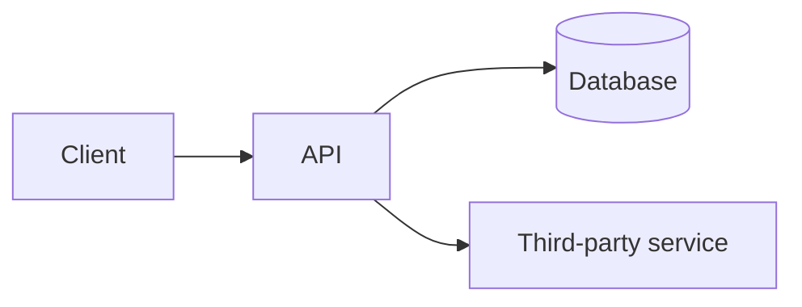

# Architecture — [Project Name]

> Descriptive, not persuasive. State what we're using and how it's shaped — save the "why" for an ADR, and only write one if the choice is genuinely non-obvious.

## Stack
List it plainly — no justification needed.

- Frontend: ...
- Backend: ...
- Database: ...
- Hosting: ...
- Other services (auth, storage, email, etc.): ...

## System flow
One diagram, kept small (5–10 boxes max). Skip this entirely if the system is simple enough to describe in a few sentences instead.

## Modules
Split by **domain/responsibility**, not by technical layer. Ask: "if two people/agent sessions worked on two different modules at once, would they step on each other?" If yes, that's not a clean split.

- `auth` — ...
- `[feature]` — ...
- `[feature]` — ...

This split is a starting point, not a contract — it's allowed to evolve. If it changes in a non-obvious way later, that's an ADR.

## API contract (if frontend/backend are separate)
Minimal — enough for both sides to build independently without drifting. If this list grows past ~10-15 endpoints, split it into `docs/api-contract.md` and link it here instead.

| Method | Path | Request | Response |
|---|---|---|---|
| GET | /api/... | — | `{ ... }` |
| POST | /api/... | `{ ... }` | `{ ... }` |

## Data model (optional)
Only include if there are non-obvious relationships. A short list of entities and how they relate is enough — no formal ER diagram needed unless the schema is genuinely complex.

- `User` — has many `[X]`
- `[Entity]` — belongs to `[Y]`

## Constraints
Keep this to 3–5 bullets. These are the things an agent would otherwise silently guess wrong.

- Expected scale: ...
- Performance: ...
- Security musts: ...
- Anything explicitly NOT needed (e.g. "no need to support offline mode")

---

**Exit check:** Could a coding agent read this and know which module a new slice belongs in, without asking you?