# Architecture — Loan Repayment Risk Prediction

## Stack
- Python
- pandas / NumPy
- scikit-learn / XGBoost
- Matplotlib / Seaborn
- Streamlit
- joblib
- Local Home Credit CSV files

## System flow

```mermaid
flowchart LR
 A[Seven raw CSV tables] --> B[Validation]
 B --> C[Applicant-level aggregation]
 C --> D[Feature engineering]
 D --> E[Train / validation / test]
 E --> F[Leakage-safe preprocessing]
 F --> G[Baseline model comparison]
 G --> H[Controlled XGBoost tuning]
 H --> I[Validation threshold analysis]
 I --> J[Final test evaluation]
 J --> K[Explainability + demo]
```


## Modules
- `data_loader` — locate/read local source tables.
- `aggregation` — reduce historical tables to `SK_ID_CURR` aggregates; chunk large files.
- `feature_engineering` — financial ratios and compact repayment features.
- `preprocessing` — imputation, encoding, and scaling where required.
- `train` — train candidate baseline models and persist model artifacts.
- `tune_xgboost` — run the controlled XGBoost validation experiment.
- `evaluate` — metrics, curves, confusion matrix, threshold analysis, and final evaluation.
- `app` — lightweight Streamlit demo.

## Relationships
```text
application_train
  └── SK_ID_CURR
       ├── bureau
       │    └── bureau_balance via SK_ID_BUREAU
       └── previous_application
            ├── POS_CASH_balance via SK_ID_PREV
            ├── installments_payments via SK_ID_PREV
            └── credit_card_balance via SK_ID_PREV
```

The final modeling table has one row per `SK_ID_CURR`.

## Feature groups
- Application: selected current variables and valid ratios such as credit/income and annuity/income.
- Bureau: account, active/overdue, credit/debt/overdue, and compact bureau-balance history aggregates.
- Previous applications: count, approval/refusal, historical credit/application amounts.
- POS/CASH: history and DPD statistics.
- Installments: payment/installment ratios, late counts/ratios, payment delays.
- Credit card: history, balance/limit, and delinquency statistics.

Exact formulas must follow the actual CSV schema.

## Models
1. Logistic Regression — baseline.
2. Random Forest — nonlinear tree baseline.
3. XGBoost — primary boosting candidate.
4. HistGradientBoostingClassifier — fallback if XGBoost is unavailable/impractical.

## Controlled tuning
Only XGBoost is tuned. Twenty deterministic candidate configurations are sampled with seed 42. The search covers tree complexity, learning rate, row/column subsampling, regularization, and `scale_pos_weight`.

Selection is based on validation PR-AUC, with validation ROC-AUC and F1 as tie-breakers. The original XGBoost artifact is preserved until the tuned candidate is reviewed.

## Evaluation
ROC-AUC, PR-AUC, precision, recall, F1, and confusion matrix. Model selection and threshold selection use validation data only. Final test evaluation happens only after the selected model and threshold are frozen.

## Constraints
- Raw data outside Git.
- Avoid loading all large tables simultaneously.
- No target leakage.
- Fixed random seed.
- No exhaustive tuning across all models.
- No tuning after final test inspection.
